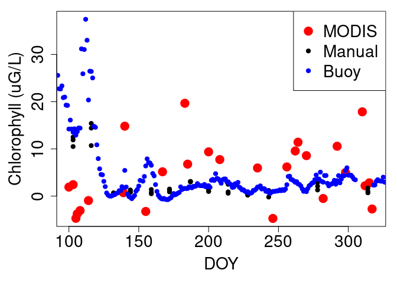

# GLEON / EDI / NASA workflow

This is an example R workflow of integrating data from the Global Lake
Ecological Observatory Network, Environmental Data Initiative, and NASA
remote sensing products to study water quality.

## Example

### Load libraries

``` r
# remotes::install_github("EDIorg/EDIutils", ref = "cran") # run this once to install EDIutils package
library(EDIutils)
library(dplyr)
library(tidyr)
```

### Define variables and intake data

``` r
# define which manual chlorophyll measurement to use
manual_chl_column = "correct_chl_fluor"
# define which lake to analyze
lake = "ME"
# define depths of manual chl samples to use
depths_use = c("0-2", "0-8")

# Data imported from MODIS
# TO-DO: implement; currently MODIS data are processed manually in SeaDAS
MODIS <- read.csv("data/LakeMendota_MODIS_chl_v4.csv", header = TRUE)

#Function for receiving packages from EDI 
dataIntake <- function(pid) {
  # Package of interest
  packageId <- pid 
  # Read data entity names and corresponding identifiers
  data_entities <- read_data_entity_names(packageId)
  
  # Select a data entity to read and get its id
  i <- grepl("Daily", data_entities$entityName)
  if(length(i) == 1){
    i = TRUE
  }
  entityId <- data_entities$entityId[i]
  
  # Use the entity id to read the raw data
  raw <- read_data_entity(packageId, entityId)
  
  # Get the physical attributes of the data entity
  eml <- read_metadata(packageId)
  library(xml2)
  physical <- xml_find_all(eml, ".//physical")[which(i)]
  headerlines <-xml_text(xml_find_all(physical, ".//numHeaderLines"))
  headerlines <- as.numeric(headerlines) - 1 # Subtract 1 from the header line if the first row contain column names
  delimiter <- xml_text(xml_find_all(physical, ".//fieldDelimiter"))
  quotechar <- xml_text(xml_find_all(physical, ".//quoteCharacter"))
  
  # Use a parser to read the data in a more useful form
  library(readr)
  data <- readr::read_delim(file = raw, 
                            delim = delimiter, 
                            quote = quotechar, 
                            skip = headerlines)
  return(data)
}  

#Call for EDI function 
mendotaBuoy <- dataIntake("knb-lter-ntl.129.31")
buoyTemp <- dataIntake("knb-lter-ntl.130.29")
manChl <- dataIntake("knb-lter-ntl.38.27")
```

### Transform buoy data

``` r
buoyTempAdjust <- function(
  obsYear, 
  lake = 'ME', 
  manual_chl_depths = c('0-2'), 
  chl_column = "correct_chl_fluor", 
  logTransform = FALSE
  ) {

  year_select <- obsYear
  
  ntl_manual_chlor <- manChl %>% 
    filter(year4 == year_select & depth_range_m %in% manual_chl_depths) %>% 
    filter(lakeid == lake) %>% 
    select(sampledate, mono_chl_spec, correct_chl_fluor)
  
  
  ntl_sfc_wt <- buoyTemp %>% 
    filter(year4 == year_select) %>% 
    filter(depth==0.0) %>% ##zero depth water temperature
    filter(is.na(flag_wtemp)) %>% 
    drop_na(wtemp) %>% 
    select(sampledate,wtemp)
  
  ntl_chla <- mendotaBuoy %>% 
    filter(year4 == year_select) %>% 
    filter(is.na(flag_avg_chlor)) %>% 
    drop_na(avg_chlor) %>% 
    select(sampledate,avg_chlor)
  
  ntl_data_full <- ntl_chla %>% 
    right_join(ntl_sfc_wt, by = c('sampledate')) %>% 
    drop_na(avg_chlor)
  
  
  #temp correction
  ntl_data_full$chlor_temp_corr <- ntl_data_full$avg_chlor/(1 + (-0.012*(ntl_data_full$wtemp - 20)))
  
  if(logTransform){
    ntl_data_full$chlor_temp_corr <- log10(ntl_data_full$chlor_temp_corr) 
  }
  
  #standardize buoy sensor  chl
  ntl_data_full$chlor_std_transform <- (ntl_data_full$chlor_temp_corr - mean(ntl_data_full$chlor_temp_corr)) /
    sd(ntl_data_full$chlor_temp_corr, na.rm=T) 
  # back transform to manual chl units
  manual_chl_values <- pull(ntl_manual_chlor[, chl_column])
  ntl_data_full$reverse_transform <- ntl_data_full$chlor_std_transform * sd(manual_chl_values, na.rm=T) + 
    mean(manual_chl_values, na.rm=T)
  
  return(ntl_data_full)
}

buoyChl2016 <- buoyTempAdjust(
  obsYear = 2016, 
  lake=lake, 
  manual_chl_depths = depths_use, 
  chl_column = manual_chl_column, 
  logTransform = F
  )
```

### Organize data

``` r
#Addition of DOY column
buoyChl2016$DOY <- as.numeric(strftime(buoyChl2016$sampledate, format = "%j"))
mendotaBuoy$DOY <- as.numeric(strftime(mendotaBuoy$sampledate, format = "%j"))
manChl$DOY <- as.numeric(strftime(manChl$sampledate, format = "%j"))

#Subset manChl for 2016
manChl2016 <- subset(manChl, 
                     year4 == 2016 & depth_range_m %in% depths_use & lakeid == lake,
                     select = c( DOY, mono_chl_spec, correct_chl_fluor)) 

#Organize MODIS values into chronological order
MODIS <- MODIS[order(MODIS$Year),]

#Subset MODIS for 2016
MODIS2016<- subset(MODIS, Year == 2016, select = c(DOY, chl_mean_all, chl_mean_near_or))
```

### Transform MODIS data

``` r
#Standardize MODIS values to Manual Chlorophyll values
MODIS_std_transform2016 <-  (MODIS2016$chl_mean_all - mean(MODIS2016$chl_mean_all, na.rm=T)) / 
  sd(MODIS2016$chl_mean_all, na.rm=T)
# back transform to manual chl units
manual_chl_values = pull(manChl2016[, manual_chl_column])
MODIS_reverse_transform2016 <- (MODIS_std_transform2016 * sd(manual_chl_values, na.rm=T)) + 
  mean(manual_chl_values)
```

### Plot values

``` r
par(mar=c(5,5,1,1))
Ylim = range(
  c(MODIS_reverse_transform2016, 
    manChl2016$mono_chl_spec, 
    buoyChl2016$reverse_transform),
  na.rm=T
  )
plot(
  MODIS2016$DOY, MODIS_reverse_transform2016, 
  col = "red", pch = 19, cex = 2, 
  xlab = "DOY", ylab = "Chlorophyll (uG/L)", 
  cex.lab = 1.75, cex.axis = 1.75, cex.main = 1.5, cex.sub = 1.5, 
  ylim = Ylim
  )
points(manChl2016$DOY, pull(manChl2016[, manual_chl_column]), col = "black", pch = 19)
points(buoyChl2016$DOY, buoyChl2016$reverse_transform, col = "blue", pch = 19)
legend(
  "topright", c("MODIS", "Manual", "Buoy"), 
  col=c("red", "black", "blue"), 
  pch = 19, pt.cex = c(2,1,1) , cex = 1.75
  )
```


